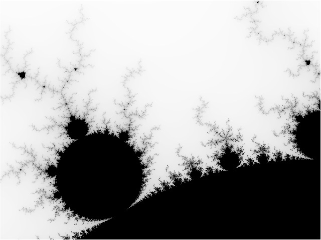

# Mandelbrot in C

This repository contains a modern C (C99) implementation for generating visualizations of the Mandelbrot set. It is part of a larger project comparing implementations across various programming languages.

The program compiles to a single native executable. It can render the Mandelbrot set directly to the terminal as ASCII art or produce a data file for `gnuplot` to generate a high-resolution PNG image.

### Other Language Implementations

This project compares the performance and features of Mandelbrot set generation in different languages.

| Language  | Repository                                               | Key Features                                 |
| :-------- | :------------------------------------------------------- | :------------------------------------------- |
| Rust      | [mandelbrot-rs](https://github.com/jesper-olsen/mandelbrot-rs)     | Multi-threaded, Direct PNG output            |
| Python    | [mandelbrot-py](https://github.com/jesper-olsen/mandelbrot-py)     | Multi-threaded, Direct PNG output            |
| Mojo      | [mandelbrot-mojo](https://github.com/jesper-olsen/mandelbrot-mojo) | Multi-threaded, Gnuplot-based PNG            |
| Erlang    | [mandelbrot_erl](https://github.com/jesper-olsen/mandelbrot_erl)   | Multi-process, Direct PNG output   |
| Fortran   | [mandelbrot-f](https://github.com/jesper-olsen/mandelbrot-f)       | Single-threaded, Gnuplot-based PNG           |
| Nushell   | [mandelbrot-nu](https://github.com/jesper-olsen/mandelbrot-nu)     | Single-threaded, Gnuplot-based PNG           |
| R         | [mandelbrot-R](https://github.com/jesper-olsen/mandelbrot-R)       | Single-threaded, Gnuplot-based PNG           |
| Tcl       | [mandelbrot-tcl](https://github.com/jesper-olsen/mandelbrot-tcl)   | Single-threaded, Gnuplot-based PNG           |
| Lua       | [mandelbrot-lua](https://github.com/jesper-olsen/mandelbrot-lua)   | Single-threaded, Gnuplot-based PNG           |
| **C**     | [mandelbrot-c](https://github.com/jesper-olsen/mandelbrot-c)       | Single-threaded, Gnuplot-based PNG           |


---

## Prerequisites

You will need the following installed:

1.  A **C Compiler** (e.g., GCC or Clang).
2.  **Make** (optional, but recommended for easy building).
3.  **Gnuplot** (required *only* for generating PNG images).

---

## Build

You can compile the program directly or use the provided Makefile.

**Option 1: Manual Compilation**
The `-lm` flag links the math library, and `-O3` enables aggressive optimizations.

```sh
gcc -o mandelbrot mandelbrot.c -lm -O3
```

**Option 2: Using Make**
Simply run `make` in the project directory.

```sh
make
```

---

## Usage

The compiled executable can be configured via command-line arguments using a `key=value` format.

### 1. ASCII Art Output

To render the Mandelbrot set directly in your terminal, run the executable.

```sh
./mandelbrot
```

You can change the view and resolution by passing parameters:
```sh
# Zoom in on a different area with a wider view
./mandelbrot width=120 ll_x=-0.75 ll_y=0.1 ur_x=-0.74 ur_y=0.11
```

### 2. PNG Image Generation

To create a high-resolution PNG, you first generate a data file and then process it with `gnuplot`.

**Step 1: Generate the data file**
Set `png=1` and specify the desired dimensions. Redirect the output to a file.

```sh
./mandelbrot png=1 width=1000 height=750 > image.dat
```

**Step 3: Run gnuplot**
This will read `image.dat` and create `mandelbrot.png`.

```sh
gnuplot topng.gp
```
The result is a high-quality `mandelbrot.png` image.



## Performance

Benchmarks were run on an **Apple M1** system with Apple clang version 17.0.0 

**Generating a 1000x750 data file:**
```sh
% time ./mandelbrot png=1 width=1000 height=750 > image.dat
0.30s user 0.01s system 96% cpu 0.329 total
```

**Generating a 5000x5000 data file:**
```sh
% time ./mandelbrot png=1 width=5000 height=5000 > image.dat
8.85s user 0.13s system 98% cpu 9.137 total
```

